### 多线程进阶==>JUC编发编程

#### 1、什么是JUC 

[java.util.concurrent](https://tool.oschina.net/uploads/apidocs/jdk-zh/java/util/concurrent/package-frame.html) 

Thread

1. Runable 没有返回值，效率相比 Callable 相对较低

#### 2、线程和线程
1. 进程：一个程序 QQ Music 程序的集合
2. 线程：java默认2个线程 main GC

对java而言 Thread Runable Callable

__java真的可以开启线程吗？__ 开不了
```java
public synchronized void start() {
    /**
     * This method is not invoked for the main method thread or "system"
     * group threads created/set up by the VM. Any new functionality added
     * to this method in the future may have to also be added to the VM.
     *
     * A zero status value corresponds to state "NEW".
     */
    if (threadStatus != 0)
        throw new IllegalThreadStateException();

    /* Notify the group that this thread is about to be started
     * so that it can be added to the group's list of threads
     * and the group's unstarted count can be decremented. */
    group.add(this);

    boolean started = false;
    try {
        start0();
        started = true;
    } finally {
        try {
            if (!started) {
                group.threadStartFailed(this);
            }
        } catch (Throwable ignore) {
            /* do nothing. If start0 threw a Throwable then
              it will be passed up the call stack */
        }
    }
}
// 本地方法，底层调用C++ java无法直接操作硬件
private native void start0();
```


> 并发 并行   

并发编程：并发，并行
并发：多线程操作同一个资源
并行：多核cpu下，多个cpu同时处理

并发编程的本质：__充分利用CPU的资源__


> 线程有几个状态？

```java
public enum State {
  NEW, //新生
  RUNNABLE, // 运行
  BLOCKED, // 阻塞
  WAITING, // 等待 死死的等
  TIMED_WAITING, // 超时等待
  TERMINATED; // 终止
}
```


> wait 和sleep 的区别

__1、来自不同的类__

wait ==> Object

sleep ==> Thread

__2、关于锁的释放__

wait： 会释放 

sleep： 睡觉了，抱着睡觉，不会释放

__3、使用的范围不同__

wait： 必须在同步代码块中国呢

sleep：可以在任何地方使用

#### 3、Lock锁（终点）

> synchronized

```java
package com.javaniuniu.demo01;

/**
 * @auther: javaniuniu
 * @date: 2020/6/27 7:55 PM
 */

/**
 * 真正的多线程并发，公司中的开发，降低耦合性
 * 线程就是一个单独的资源类，没有任何附属操作
 * 1、属性，方法
 */
public class SaleTicketDemo01 {

    public static void main(String[] args) {
        // 并发：多线程操作同一资源类，把资源类丢入线程
        Ticket ticket = new Ticket();

        // @FunctionalInterface 函数式编程
        new Thread(() ->{
            for (int i = 1; i <=60 ; i++) {
                ticket.salse();
            }

        },"A").start();
        new Thread(() ->{
            for (int i = 1; i <=60 ; i++) {
                ticket.salse();
            }
        },"B").start();
        new Thread(() ->{
            for (int i = 1; i <=60 ; i++) {
                ticket.salse();
            }
        },"C").start();
    }
}

// 资源类 OOP
class Ticket{
    // 属性，方法
    private int number = 50;

    // synchronized 本质 排队 锁
    public synchronized void salse() {
        if (number > 0) {
            System.out.println(
                    Thread.currentThread().getName() + "卖出了1票,剩余："+(--number) +"张票");
        }
    }
}
```

> Lock

- [ReentrantLock](https://www.matools.com/file/manual/jdk_api_1.8_google/java/util/concurrent/locks/ReentrantLock.html) 可重入锁
- [ReentrantReadWriteLock.ReadLock](https://www.matools.com/file/manual/jdk_api_1.8_google/java/util/concurrent/locks/ReentrantReadWriteLock.ReadLock.html) 读锁
- [ReentrantReadWriteLock.WriteLock](https://www.matools.com/file/manual/jdk_api_1.8_google/java/util/concurrent/locks/ReentrantReadWriteLock.WriteLock.html) 写锁

1、[ReentrantLock](https://www.matools.com/file/manual/jdk_api_1.8_google/java/util/concurrent/locks/ReentrantLock.html)

NonfairSync ：__非公平锁 ，可插队 （默认）__

FairSync：公平锁 ，不可插队

```java
package com.javaniuniu.demo01;

import java.util.concurrent.locks.Lock;
import java.util.concurrent.locks.ReentrantLock;

/**
 * @auther: javaniuniu
 * @date: 2020/6/27 9:59 PM
 */
public class SaleTicketDemo02 {

    public static void main(String[] args) {
        // 并发：多线程操作同一资源类，把资源类丢入线程
        Ticket2 ticket = new Ticket2();

        // @FunctionalInterface 函数式编程
        new Thread(() ->{ for (int i = 1; i <=60 ; i++) ticket.salse();},"A").start();
        new Thread(() ->{ for (int i = 1; i <=60 ; i++) ticket.salse();},"B").start();
        new Thread(() ->{ for (int i = 1; i <=60 ; i++) ticket.salse();},"C").start();

    }
}

// lock 三部曲
// 1、 new ReentrantLock()
// 2、 lock.lock(); // 加锁
// 3、 lock.unlock(); // 解锁
class Ticket2{
    // 属性，方法
    private int number = 30;

    Lock lock = new ReentrantLock();

    // synchronized 本质 排队 锁
    public synchronized void salse() {
        lock.lock(); // 加锁


        try {
            if (number > 0) {
                System.out.println(
                        Thread.currentThread().getName() + "卖出了1票,剩余："+(--number) +"张票");
            }
        } catch (Exception e) {
            e.printStackTrace();
        } finally {
            lock.unlock(); // 解锁
        }

    }
}
```


> synchronized 和Lock 的区别？

1、synchronized 内置关键字，Lock 是一个java类

2、synchronized 无法判断获取锁的状态， Lock 可以判断是否获取了锁

3、synchronized 会自动释放锁，Lock 必须要手动释放锁，如果不释放，就会__死锁__

4、synchronized 线程1 （获取锁，阻塞），线程2（等待，一直等）；lock不一定会等待下去,可以通过`（lock.tryLock()`  获取锁

5、synchronized 可重入锁，不可以中断的非公平锁，Lock 可以重入锁，可以判断锁释放中段，非公平（可以自己设置）

6、synchronized 适用少量的同步代码，Lock 适用大量的同步锁


> 锁是什么，如何判断锁的是谁？


#### 4、生产者和消费者

面试题：单例模式，排序算法，生产者和消费者，死锁

> synchronized 版

```java
package com.javaniuniu.pc;


/**
 * 线程之间通信稳定：生产者和消费者问题
 * 线程交替执行 A B 操作同一个变量 num=0
 * A num + 1
 * B num - 1
 */
public class A {
    public static void main(String[] args) {
        Data data = new Data();
        new Thread(()->{
            for (int i = 0; i <10 ; i++) {
                try {
                    data.increment();
                } catch (InterruptedException e) {
                    e.printStackTrace();
                }
            }
        },"A").start();
        new Thread(()->{
            for (int i = 0; i <10 ; i++) {
                try {
                    data.decrement();
                } catch (InterruptedException e) {
                    e.printStackTrace();
                }
            }
        },"B").start();
    }
}
// 资源类 独立耦合的
// 判断等待，业务，通知
class Data {

    // 属性和方法
    private int num = 0;

    // + 1
    public synchronized void increment() throws InterruptedException {
        if (num !=0){
            // 等待
            this.wait();
        }
        num ++;
        System.out.println(Thread.currentThread().getName()+"==>"+num);
        // 通知其他线程 我 + 1 完成了
        this.notifyAll();
    }
    // - 1
    public synchronized void decrement() throws InterruptedException {
        if (num ==0){
            // 等待
            this.wait();
        }
        num --;
        System.out.println(Thread.currentThread().getName()+"==>"+num);
        // 通知其他线程 我 - 1 完成了
        this.notifyAll();
    }


}
```

> 存在  A B C D 四个线程 会出现异常， 虚假唤醒，怎么解决？

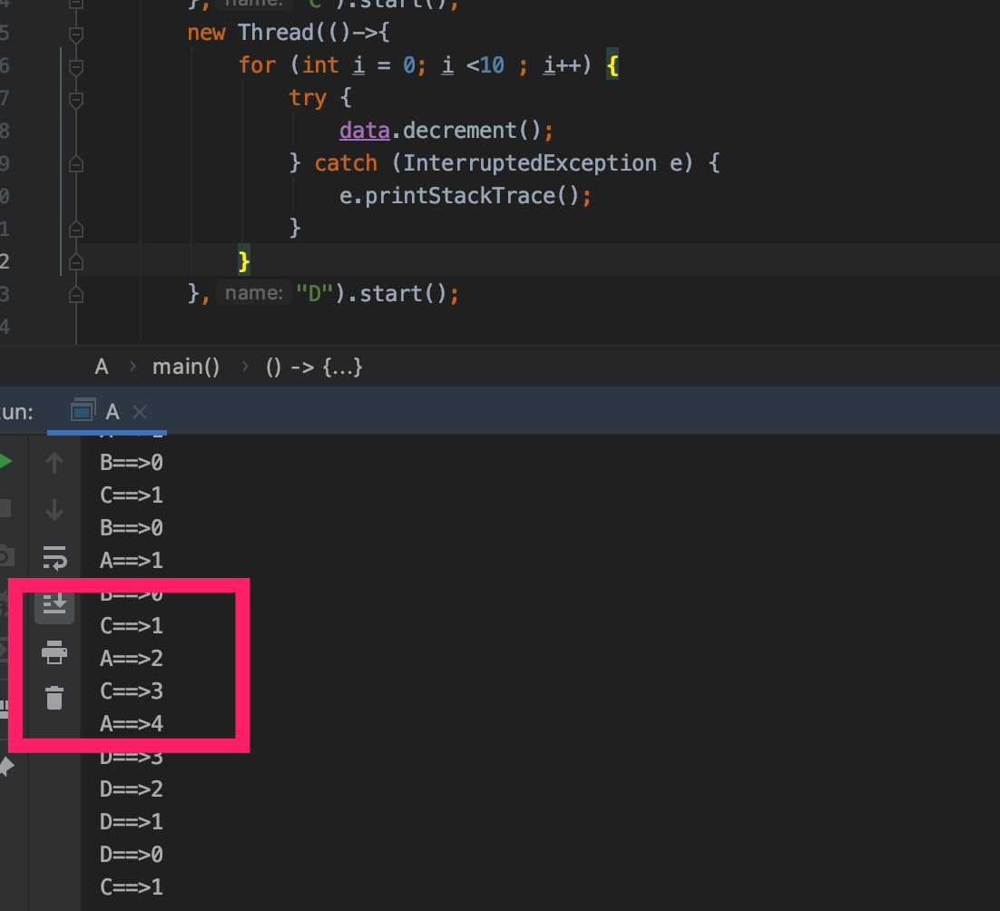


__if 改成while__

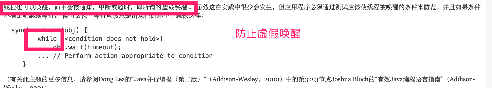

```java
package com.javaniuniu.pc;

/**
 * 线程之间通信稳定：生产者和消费者问题
 * 线程交替执行 A B 操作同一个变量 num=0
 * A num + 1
 * B num - 1
 */
public class A {
    public static void main(String[] args) {
        Data data = new Data();
        new Thread(()->{
            for (int i = 0; i <10 ; i++) {
                try {
                    data.increment();
                } catch (InterruptedException e) {
                    e.printStackTrace();
                }
            }
        },"A").start();
        new Thread(()->{
            for (int i = 0; i <10 ; i++) {
                try {
                    data.decrement();
                } catch (InterruptedException e) {
                    e.printStackTrace();
                }
            }
        },"B").start();

        new Thread(()->{
            for (int i = 0; i <10 ; i++) {
                try {
                    data.increment();
                } catch (InterruptedException e) {
                    e.printStackTrace();
                }
            }
        },"C").start();
        new Thread(()->{
            for (int i = 0; i <10 ; i++) {
                try {
                    data.decrement();
                } catch (InterruptedException e) {
                    e.printStackTrace();
                }
            }
        },"D").start();

    }
}
// 资源类 独立耦合的
// 判断等待，业务，通知
class Data {

    // 属性和方法
    private int num = 0;

    // + 1
    public synchronized void increment() throws InterruptedException {
        while (num !=0){
            // 等待
            this.wait();
        }
        num ++;
        System.out.println(Thread.currentThread().getName()+"==>"+num);
        // 通知其他线程 我 + 1 完成了
        this.notifyAll();
    }
    // - 1
    public synchronized void decrement() throws InterruptedException {
        while (num ==0){
            // 等待
            this.wait();
        }
        num --;
        System.out.println(Thread.currentThread().getName()+"==>"+num);
        // 通知其他线程 我 - 1 完成了
        this.notifyAll();
    }
}
```


> Lock 版 生产者消费者

`Condition`因素出`Object`监视器方法（ [`wait`](https://www.matools.com/file/manual/jdk_api_1.8_google/java/lang/Object.html#wait--) ， [`notify`](https://www.matools.com/file/manual/jdk_api_1.8_google/java/lang/Object.html#notify--)和[`notifyAll`](https://www.matools.com/file/manual/jdk_api_1.8_google/java/lang/Object.html#notifyAll--) ）成不同的对象，以得到具有多个等待集的每个对象，通过将它们与使用任意的组合的效果[`Lock`个](https://www.matools.com/file/manual/jdk_api_1.8_google/java/util/concurrent/locks/Lock.html)实现。 `Lock`替换`synchronized`方法和语句的使用， `Condition`取代了对象监视器方法的使用。


```java
package com.javaniuniu.pc;

import java.util.concurrent.locks.Condition;
import java.util.concurrent.locks.Lock;
import java.util.concurrent.locks.ReentrantLock;

/**
 * @auther: javaniuniu
 * @date: 2020/6/27 11:19 PM
 */
public class B {
    public static void main(String[] args) {
        Data2 data = new Data2();
        new Thread(()->{
            for (int i = 0; i <10 ; i++) {
                try {
                    data.increment();
                } catch (InterruptedException e) {
                    e.printStackTrace();
                }
            }
        },"A").start();
        new Thread(()->{
            for (int i = 0; i <10 ; i++) {
                try {
                    data.decrement();
                } catch (InterruptedException e) {
                    e.printStackTrace();
                }
            }
        },"B").start();

        new Thread(()->{
            for (int i = 0; i <10 ; i++) {
                try {
                    data.increment();
                } catch (InterruptedException e) {
                    e.printStackTrace();
                }
            }
        },"C").start();
        new Thread(()->{
            for (int i = 0; i <10 ; i++) {
                try {
                    data.decrement();
                } catch (InterruptedException e) {
                    e.printStackTrace();
                }
            }
        },"D").start();

    }
}
// 资源类 独立耦合的
// 判断等待，业务，通知
class Data2 {

    // 属性和方法
    private int num = 0;
    Lock lock = new ReentrantLock();
    Condition condition =  lock.newCondition();
//    condition.await(); // 等待
//    condition.signalAll(); // 唤醒全部

    // + 1
    public void increment() throws InterruptedException {
        lock.lock();
        try {
            // 业务代码
            while (num !=0){
                // 等待
                condition.await();
            }
            num ++;
            System.out.println(Thread.currentThread().getName()+"==>"+num);
            // 通知其他线程 我 + 1 完成了
            condition.signalAll();
        } catch (InterruptedException e) {
            e.printStackTrace();
        } finally {
            lock.unlock();
        }

    }
    // - 1
    public void decrement() throws InterruptedException {
        lock.lock();
        try {
            while (num ==0){
                // 等待
                condition.await();
            }
            num --;
            System.out.println(Thread.currentThread().getName()+"==>"+num);
            // 通知其他线程 我 - 1 完成了
            condition.signalAll();
        } catch (InterruptedException e) {
            e.printStackTrace();
        } finally {
            lock.unlock();
        }
    }


}
```

__得到的结果是随机的结果 ，我们希望 A->B->C->D 顺序执行__

> Condition 精准的通知和唤醒线程

```java
package com.javaniuniu.pc;

import java.util.concurrent.locks.Condition;
import java.util.concurrent.locks.Lock;
import java.util.concurrent.locks.ReentrantLock;


public class C {
    public static void main(String[] args) {
        Data3 data = new Data3();
        new Thread(()->{
            for (int i = 0; i <10 ; i++) {
                data.printA();
            }
        },"A").start();
        new Thread(()->{
            for (int i = 0; i <10 ; i++) {
                data.printB();
            }
        },"B").start();
        new Thread(()->{
            for (int i = 0; i <10 ; i++) {
                data.printC();
            }
        },"C").start();
    }

}

class Data3 {
    private Lock lock = new ReentrantLock();
    private Condition condition1 = lock.newCondition();
    private Condition condition2 = lock.newCondition();
    private Condition condition3 = lock.newCondition();
    private int num = 1; // 1A 2B 3C

    public void printA() {
        lock.lock();
        // 业务，判断-> 执行 --> 通知
        try {
            while (num!=1) {
                // 等待
                condition1.await();
            }
            System.out.println(Thread.currentThread().getName()+"==>AAAAA");
            // 唤醒，唤醒指定的人，B
            num = 2;
            condition2.signal();
        } catch (InterruptedException e) {
            e.printStackTrace();
        } finally {
            lock.unlock();
        }

    }
    public void printB() {
        lock.lock();
        // 业务，判断-> 执行 --> 通知
        try {
            while (num!=2) {
                // 等待
                condition2.await();
            }
            System.out.println(Thread.currentThread().getName()+"==>BBBBB");
            // 唤醒，唤醒指定的人，B
            num = 3;
            condition3.signal();
        } catch (InterruptedException e) {
            e.printStackTrace();
        } finally {
            lock.unlock();
        }
    }
    public void printC() {
        lock.lock();
        // 业务，判断-> 执行 --> 通知
        try {
            while (num!=3) {
                // 等待
                condition3.await();
            }
            System.out.println(Thread.currentThread().getName()+"==>CCCCC");
            // 唤醒，唤醒指定的人，B
            num = 1;
            condition1.signal();
        } catch (InterruptedException e) {
            e.printStackTrace();
        } finally {
            lock.unlock();
        }
    }

}
```

####  5、八锁现象

如何判断锁的是谁，知道什么是锁，锁的是谁

锁的是对象，class

**深刻理解什么是锁**

```java
package com.javaniuniu.lock8;

import java.util.concurrent.TimeUnit;

/**
 * 8锁，关于锁的8个问题
 * 1、标准情况下，两个线程先打印 发短信 还是 打电话 ？ 1、发短信 2、打电话？
 * 1、sendSms 延迟4秒，两个线程先打印 发短信 还是 打电话 ？ 1、发短信 2、打电话？
 */
public class Test1 {

    public static void main(String[] args) {
        Phone phone = new Phone();
        new Thread(()->{
            phone.sendSms();
        },"A").start();

        try {
            TimeUnit.SECONDS.sleep(2);
        } catch (InterruptedException e) {
            e.printStackTrace();
        }
        new Thread(()->{
            phone.call();
        },"B").start();
    }
}
class Phone {

    // synchronized 锁的是方法的对象，即调用者
    // 两个方法用的是同一个锁，谁先拿到谁先执行
    public synchronized void sendSms() {
        try {
            TimeUnit.SECONDS.sleep(4);
        } catch (InterruptedException e) {
            e.printStackTrace();
        }
        System.out.println("发短信");

    }
    public synchronized void call() {
        System.out.println("打电话");
    }
}
```


```java
package com.javaniuniu.lock8;

import java.util.concurrent.TimeUnit;

/**
 * 3、增加普通方法（hello() ）， 先打印 发短信 还是 打电话 ？ 1、发短信 2、打电话？
 *      - sendSms 延迟了4 秒 所以先输出 hello
 * 4、两个对象，两个同步方法 先打印 发短信 还是 打电话 ？ 1、发短信 2、打电话？
 *      - sendSms 延迟了4 秒 所以先输出 打电话
 */
public class Test2 {

    public static void main(String[] args) {
        Phone2 phone1 = new Phone2();
        Phone2 phone2 = new Phone2();
        new Thread(()->{
            phone1.sendSms();
        },"A").start();

//        try {
//            TimeUnit.SECONDS.sleep(2);
//        } catch (InterruptedException e) {
//            e.printStackTrace();
//        }
        new Thread(()->{
            phone2.call();
        },"B").start();
    }
}
class Phone2 {

    // synchronized 锁的是方法的对象，即调用者
    // 两个方法用的是同一个锁，谁先拿到谁先执行
    public synchronized void sendSms() {
        try {
            TimeUnit.SECONDS.sleep(10);
        } catch (InterruptedException e) {
            e.printStackTrace();
        }
        System.out.println("发短信");

    }
    public synchronized void call() {
        System.out.println("打电话");
    }

    // 这里没有锁，不是同步方法，不受锁的影响
    public void hello() {
        System.out.println("hello");
    }
}
```

```java
package com.javaniuniu.lock8;

import java.util.concurrent.TimeUnit;

/**
 * 5、增加两个静态的同步方法，先打印 发短信 还是 打电话 ？ 1、发短信 2、打电话？
 *      - 先发短信
 * 6、两个对象，增肌阿两个静态的同步方法，先打印 发短信 还是 打电话 ？ 1、发短信 2、打电话？
 *      - 先发短信
 */
public class Test3 {

    public static void main(String[] args) {
        Phone3 phone1 = new Phone3();
        Phone3 phone2 = new Phone3();
        new Thread(()->{
            phone1.sendSms();
        },"A").start();

//        try {
//            TimeUnit.SECONDS.sleep(2);
//        } catch (InterruptedException e) {
//            e.printStackTrace();
//        }
        new Thread(()->{
            phone2.call();
        },"B").start();
    }
}
class Phone3 {

    // synchronized 锁的是方法的对象，即调用者
    // static 静态方法
    // 类一加载就有了 锁的是 Class class 全局唯一
    public static synchronized void sendSms() {
        try {
            TimeUnit.SECONDS.sleep(10);
        } catch (InterruptedException e) {
            e.printStackTrace();
        }
        System.out.println("发短信");

    }
    public static synchronized void call() {
        System.out.println("打电话");
    }

}
```

```java
package com.javaniuniu.lock8;

import java.util.concurrent.TimeUnit;

/**
 * 7、一个静态普通同步方法 一个普通同步方法，一个对象 ，先打印 发短信 还是 打电话 ？ 1、发短信 2、打电话？
 *      - 先打电话 因为 sendSms 睡了4秒 ，且两个不是同一把锁
 * 8、一个静态普通同步方法 一个普通同步方法，两个对象，先打印 发短信 还是 打电话 ？ 1、发短信 2、打电话？
 *      - 先打电话 因为 sendSms 睡了4秒 ，且两个不是同一把锁
 */
public class Test4 {

    public static void main(String[] args) {
        Phone4 phone1 = new Phone4();
        Phone4 phone2 = new Phone4();
        new Thread(()->{
            phone1.sendSms();
        },"A").start();

//        try {
//            TimeUnit.SECONDS.sleep(2);
//        } catch (InterruptedException e) {
//            e.printStackTrace();
//        }
        new Thread(()->{
            phone2.call();
        },"B").start();
    }
}
class Phone4 {

    // synchronized 锁的是方法的对象，即调用者
    // static 静态方法
    // 类一加载就有了 锁的是 Class class 全局唯一
    public static synchronized void sendSms() {
        try {
            TimeUnit.SECONDS.sleep(10);
        } catch (InterruptedException e) {
            e.printStackTrace();
        }
        System.out.println("发短信");

    }
    // 普通同步方法
    public synchronized void call() {
        System.out.println("打电话");
    }

}
```


> 小结

new this 指的是具体的手机

static Class 唯一的一个模版


#### 6、集合类不安全

> List 不安全

```java
package com.javaniuniu.unsafe;

import java.util.*;
import java.util.concurrent.CopyOnWriteArrayList;

// java.util.ConcurrentModificationException 并发修改异常
public class ListTest {
    public static void main(String[] args) {
        // 并发下 ArrayList 不安全吗 synchronized
        /**
         * 解决方案：
         * 1、List<String> list = new Vector<>();
         * 2、List<String> list = Collections.synchronizedList(new ArrayList<>());
         * 3、List<String> list = new CopyOnWriteArrayList<>();
         */
        // CopyOnWrite 写入是复制 COW ，计算机程序设计领域的一种优化策略
        // 有多个线程调用的时候，list，读取的时候，固定，写入（覆盖）
        // 在写入的时候避免覆盖，造成数据问题
        // CopyOnWriteArrayList 比 Vector 好用在哪里
        //      -  CopyOnWriteArrayList 使用 ReentrantLock 同步锁
        //      -  Vector 使用 synchronized 同步锁
        //      -  ReentrantLock 性能优于 synchronized
        List<String> list = new CopyOnWriteArrayList<>();
        for (int i = 0; i <10 ; i++) {
            new Thread(()->{
                list.add(UUID.randomUUID().toString().substring(5));
                System.out.println(list);
            },String.valueOf(i)).start();
        }
    }
}
```


> set 不安全

```java
package com.javaniuniu.unsafe;

import java.util.Set;
import java.util.UUID;
import java.util.concurrent.CopyOnWriteArraySet;


// java.util.ConcurrentModificationException
public class SetTest {
    public static void main(String[] args) {
        /**
         * 解决方案：
         * 1、Set<String> list = Collections.synchronizedSet(new HashSet<>());
         * 2、Set<String> list = new CopyOnWriteArraySet();
         */

        Set<String> list = new CopyOnWriteArraySet();
        for (int i = 0; i <20 ; i++) {
            new Thread(()->{
                list.add(UUID.randomUUID().toString().substring(5));
                System.out.println(list);
            },String.valueOf(i)).start();
        }
    }
}
```

> hashset 底层是什么？

```java
public HashSet() {
    map = new HashMap<>();
}
// add set 本质是map key是无法重复的
public boolean add(E e) {
  return map.put(e, PRESENT)==null;
}
private static final Object PRESENT = new Object(); // 不变的值
```


> HashMap 

```java
package com.javaniuniu.unsafe;

import java.util.Collections;
import java.util.HashMap;
import java.util.Map;
import java.util.UUID;
import java.util.concurrent.ConcurrentHashMap;


// java.util.ConcurrentModificationException
public class MapTest {
    public static void main(String[] args) {
        /**
         * 解决方案
         * 1、Map<String,String> map = Collections.synchronizedMap(new HashMap<>());
         * 2、Map<String,String> map = new ConcurrentHashMap<>();
         */
        Map<String,String> map = new ConcurrentHashMap<>();
        for (int i = 0; i <10 ; i++) {
            new Thread(()-> {
                map.put(Thread.currentThread().getName(), UUID.randomUUID().toString().substring(0,5));
                System.out.println(map);
            },String.valueOf(i)).start();
        }
    }
}
```


#### 7、Callable

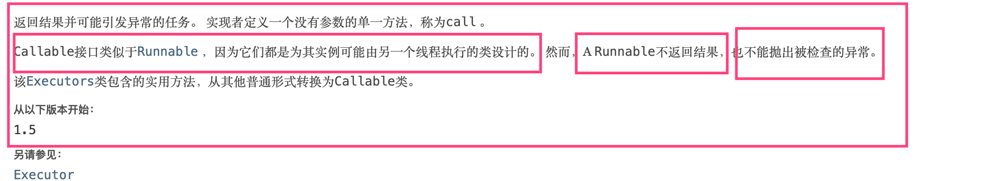

1. 可以有返回值
2. 可以抛出一次
3. 方法不同 run() call()


```java
package com.javaniuniu.callable;

import java.util.concurrent.Callable;
import java.util.concurrent.ExecutionException;
import java.util.concurrent.FutureTask;

/**
 * @auther: javaniuniu
 * @date: 2020/6/28 2:15 AM
 */
public class CallableTest {
    public static void main(String[] args) throws ExecutionException, InterruptedException {
//        new Thread(new Runnable()).start();
//        new Thread(new FutureTask<V>()).start(); FutureTask 是 Runnable 的实现类
//        new Thread(new FutureTask<V>(Callable )).start(); FutureTask 的构造函数调用  Callable


        MyThread thread = new MyThread();
        FutureTask futureTask = new FutureTask(thread); // 适配类
        new Thread(futureTask,"A").start();
        new Thread(futureTask,"B").start(); // 结果会被缓存，效率高  所以callable 只打印来一次返回值

        String string = (String) futureTask.get(); // 获取 Callable 的返回结果
        // futureTask.get() 为了获取返回值，可能会出现阻塞，所以把这个方法放在最后 或使用异步通信来处理
        System.out.println(string);


    }
}
class MyThread implements Callable<String>{

  	// 范性的参数类型=方法的返回类型
    @Override
    public String call() throws Exception {
        // 耗时操作 。。。

        return "隋东风";
    }
}

```


__细节__

1、有缓存 （）

2、结果可能需要等待，会阻塞（可通过异步通信调用）


#### 8、常用的辅助类(必会)

##### 8、1 CountDownLatch

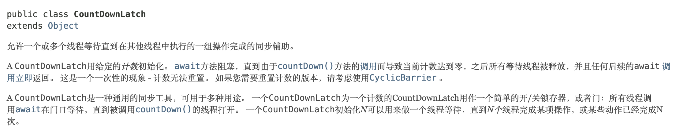

```java
package com.javaniuniu.add;

import java.util.concurrent.CountDownLatch;

// 减法计数器
public class CountDownLatchDemo {
    public static void main(String[] args) throws InterruptedException {
        // 总数是6，必须要执行任务的时候 再使用
        CountDownLatch countDownLatch = new CountDownLatch(6);
        for (int i = 0; i < 6; i++) {
            new Thread(()->{
                System.out.println(Thread.currentThread().getName()+"Go out");
                countDownLatch.countDown();// 数量 -1
            },String.valueOf(i)).start();
        }

        countDownLatch.await(); // 等待计数器归零，再向下执行
        System.out.println("close Door");
    }
}
```

__执行流程__

1. `countDownLatch.countDown()`;// 数量 -1
2. `countDownLatch.await()`; // 等待计数器归零，再向下执行
3. 每次有线程执行 `countDown()` 数量 -1，假设计数器变为0，`countDownLatch.await()` 被唤醒，在向下执行


##### 8、2 CyclicBarrier

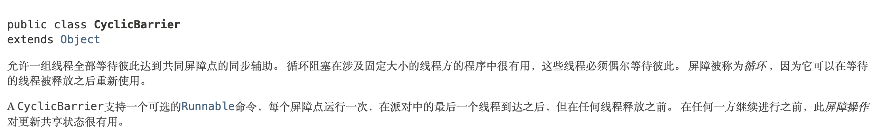

```java
package com.javaniuniu.add;

import java.util.concurrent.BrokenBarrierException;
import java.util.concurrent.CyclicBarrier;

// 加法计数器
public class CyclicBarrierDemo {
    public static void main(String[] args) {
        /**
         * 集齐7颗龙珠，召唤神龙
         * 召唤龙珠的线程
         */
        CyclicBarrier cyclicBarrier = new CyclicBarrier(7,()->{
            System.out.println("召唤神龙");
        });
        for (int i = 0; i < 7; i++) {
            final int temp = i;
            new Thread(()->{
                try {
                    System.out.println(Thread.currentThread().getName()+"收集"+temp+"个龙珠");
                    cyclicBarrier.await();// 等待，await()会计数，计数完了后，会开启新的线程执行
                } catch (InterruptedException e) {
                    e.printStackTrace();
                } catch (BrokenBarrierException e) {
                    e.printStackTrace();
                }
            }).start();
        }
    }
}
```


##### 8、3 Semaphore

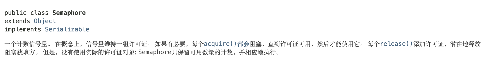

__举例，停车位 6辆车-3个停车位__

```java
package com.javaniuniu.add;

import java.util.concurrent.Semaphore;
import java.util.concurrent.TimeUnit;

public class SemaphoreDemo {
    public static void main(String[] args) {
        // 线程数量，停车位，限流
        Semaphore semaphore = new Semaphore(3);
        for (int i = 1; i <=6 ; i++) {
            new Thread(()->{
                // acquire() 得到
                try {
                    semaphore.acquire();
                    System.out.println(Thread.currentThread().getName()+"抢到了车位");
                    TimeUnit.SECONDS.sleep(2);
                    System.out.println(Thread.currentThread().getName()+"离开了车位");
                } catch (InterruptedException e) {
                    e.printStackTrace();
                }finally {
                    // release() 释放
                    semaphore.release();
                }

            },String.valueOf(i)).start();
        }

    }
}
```

`semaphore.acquire()` 获得，假设如果已经满了，等待，等待被释放

`semaphore.release()` 释放，会将当前的信号量释放 +1，然后唤醒等待的线程

__作用：多个共享资源互斥使用，并发限流，控制最大的线程数！__


#### 9、读写锁

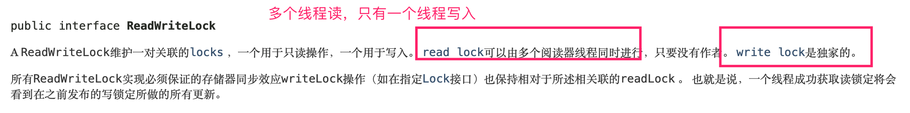

```java
package com.javaniuniu.rw;

import java.util.HashMap;
import java.util.Map;
import java.util.concurrent.locks.ReadWriteLock;
import java.util.concurrent.locks.ReentrantReadWriteLock;

/**
 * 独占锁 （写锁） 一次只能被一个线程占有
 * 贡献锁 （读锁） 多个线程可以同时占有
 * ReadWriteLock
 * 读-读 可以共存
 * 读-写 不可共存
 * 写-写 不可共存
 */
public class ReadWriteLockDemo {
    public static void main(String[] args) {
//        MyCache cache = new MyCache();
        MyCacheLock cache = new MyCacheLock();

        for (int i = 1; i <= 5; i++) {
            final int temp = i;
            new Thread(()->{
                cache.put(temp+"",temp+"");
            },String.valueOf(i)).start();
        }

        for (int i = 1; i <= 5; i++) {
            final int temp = i;
            new Thread(()->{
                cache.get(temp+"");
            },String.valueOf(i)).start();
        }
    }
}

// 加锁版
class MyCacheLock {
    private volatile Map<String,Object> map = new HashMap<>();
    // 读写锁，更加细粒度的控制
    private ReadWriteLock readWriteLock = new ReentrantReadWriteLock();

    // 存 写 , 写入的时候，只有一个线程写
    public void put(String key,Object value) {
        readWriteLock.writeLock().lock();
        try {
            System.out.println(Thread.currentThread().getName()+"写入" +key);
            map.put(key,value);
            System.out.println(Thread.currentThread().getName()+"写入OK");
        } catch (Exception e) {
            e.printStackTrace();
        } finally {
            readWriteLock.writeLock().unlock();
        }
    }
    // 取 读,所有线程可读
    public void get(String key) {
        readWriteLock.readLock().lock();
        try {
            System.out.println(Thread.currentThread().getName()+"读取" +key);
            map.get(key);
            System.out.println(Thread.currentThread().getName()+"读取OK");
        } catch (Exception e) {
            e.printStackTrace();
        } finally {
            readWriteLock.readLock().unlock();
        }
    }
}

/**
 * 自定义缓存
 */
class MyCache{
    private volatile Map<String,Object> map = new HashMap<>();

    // 存 写
    public void put(String key,Object value) {
        System.out.println(Thread.currentThread().getName()+"写入" +key);
        map.put(key,value);
        System.out.println(Thread.currentThread().getName()+"写入OK");
    }
    // 取 读
    public void get(String key) {
        System.out.println(Thread.currentThread().getName()+"读取" +key);
        map.get(key);
        System.out.println(Thread.currentThread().getName()+"读取OK");
    }
}
```


#### 10、阻塞队列

__写入：如果队列是满的，就必须阻塞等待__

__取：如果队列是空的，必须阻塞等待生产__


__BlockingQueue__

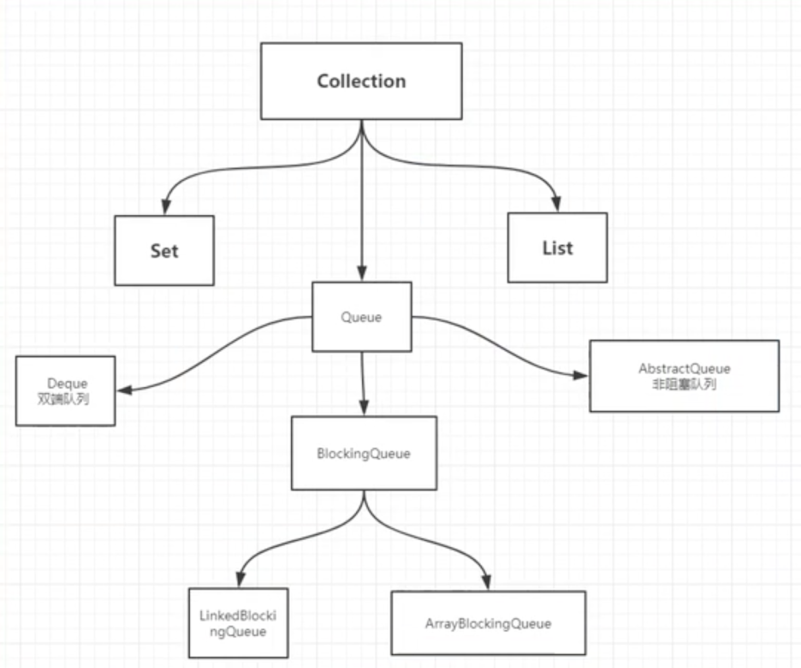

什么情况下我们会使用：多线程，线程池


##### 四组API__

| 方式           | 抛出异常  | 不抛出异常，有返回值 | 阻塞等待 | 超时等待  |
| -------------- | --------- | -------------------- | -------- | --------- |
| 增加           | add()     | offer()              | put()    | offer(,,) |
| 移除           | remove()  | poll()               | take()   | poll(,)   |
| 判断是否为队首 | element() | peek()               | -        | -         |

```java
// 抛出异常
public static void test1() {
  // 队列大小
  ArrayBlockingQueue blockingQueue = new ArrayBlockingQueue(3);
  System.out.println(blockingQueue.add("A"));
  System.out.println(blockingQueue.add("B"));
  System.out.println(blockingQueue.add("C"));

  // IllegalStateException: Queue full 抛出异常
  //        System.out.println(blockingQueue.add("D"));
  System.out.println("====================");

  System.out.println(blockingQueue.element());// 查看对首元素

  System.out.println(blockingQueue.remove());
  System.out.println(blockingQueue.remove());
  System.out.println(blockingQueue.remove());
  // java.util.NoSuchElementException 抛出异常
  //        System.out.println(blockingQueue.remove());


}

// 有返回值 没有异常
public static void test2() {
  // 队列大小
  ArrayBlockingQueue blockingQueue = new ArrayBlockingQueue(3);
  System.out.println(blockingQueue.offer("A"));
  System.out.println(blockingQueue.offer("B"));
  System.out.println(blockingQueue.offer("C"));

  // false 不抛出异常
  //        System.out.println(blockingQueue.offer("D"));
  System.out.println("====================");

  System.out.println(blockingQueue.peek());// 查看对首元素

  System.out.println(blockingQueue.poll());
  System.out.println(blockingQueue.poll());
  System.out.println(blockingQueue.poll());
  // null 不抛出异常
  //        System.out.println(blockingQueue.poll());

}

// 等待，阻塞（一直阻塞）
public static void test3() throws InterruptedException {
  // 队列大小
  ArrayBlockingQueue blockingQueue = new ArrayBlockingQueue(3);


  blockingQueue.put("A");
  blockingQueue.put("B");
  blockingQueue.put("C");

  // 一直阻塞
  //        blockingQueue.put("D");
  System.out.println("====================");

  System.out.println(blockingQueue.take());
  System.out.println(blockingQueue.take());
  System.out.println(blockingQueue.take());
  // 一直阻塞
  //        System.out.println(blockingQueue.take());

}


// 等待，阻塞（等待超时）
public static void test4() throws InterruptedException {
  // 队列大小
  ArrayBlockingQueue blockingQueue = new ArrayBlockingQueue(3);


  blockingQueue.offer("A");
  blockingQueue.offer("B");
  blockingQueue.offer("C");
  blockingQueue.offer("D",2, TimeUnit.SECONDS); // 等待 超过2秒 退出

  System.out.println("====================");

  System.out.println(blockingQueue.poll());
  System.out.println(blockingQueue.poll());
  System.out.println(blockingQueue.poll());


  System.out.println(blockingQueue.poll(2, TimeUnit.SECONDS)); // 等待 超过2秒 退出

}
```


> SynchronizedQueue 同步队列

__没有容量: __  进去一个元素，必须等待取出来后，才能再往里面放一个元素

put     take

```java
package com.javaniuniu.bq;

import java.util.concurrent.BlockingQueue;
import java.util.concurrent.SynchronousQueue;
import java.util.concurrent.TimeUnit;

/**
 * 同步队列
 * 和其他 BlockingQueue 不一样，SynchronousQueue 不存储元素
 * put 了一个元素，必须从里面先 take 取出来，否则不能在 put 进去值
 */
public class SynchronizedQueueTest {
    public static void main(String[] args) {
        BlockingQueue<String> blockingQueue = new SynchronousQueue(); // 同步队列

        new Thread(()->{
            try {
                System.out.println(Thread.currentThread().getName()+" put 1");
                blockingQueue.put("1");
                System.out.println(Thread.currentThread().getName()+" put 2");
                blockingQueue.put("2");
                System.out.println(Thread.currentThread().getName()+" put 3");
                blockingQueue.put("3");
            } catch (InterruptedException e) {
                e.printStackTrace();
            }
        },"T1").start();

        new Thread(()->{
            try {
                TimeUnit.SECONDS.sleep(3);
                System.out.println(Thread.currentThread().getName()+"take ==> " + blockingQueue.take());
                TimeUnit.SECONDS.sleep(3);
                System.out.println(Thread.currentThread().getName()+"take ==> " + blockingQueue.take());
                TimeUnit.SECONDS.sleep(3);
                System.out.println(Thread.currentThread().getName()+"take ==> " + blockingQueue.take());
            } catch (InterruptedException e) {
                e.printStackTrace();
            }
        },"T2").start();
    }
}
```


#### 11、线程池（重点）

线程池：三大方法，7大参数，4中拒绝策略

> 池化技术

程序运行，本质：占用系统的资源，优化资源的使用 == > 池化技术

线程池，链接池，内存池，对象池 //。。。

池化技术：事先准备好一些资源，有人要用，就来我这里拿，用完之后还给我


__线程池的好处：__

1. 降低资源的消耗
2. 提高响应的速度
3. 方便管理

**线程复用，可以控制最大并发数，管理线程**

> 线程 三大方法

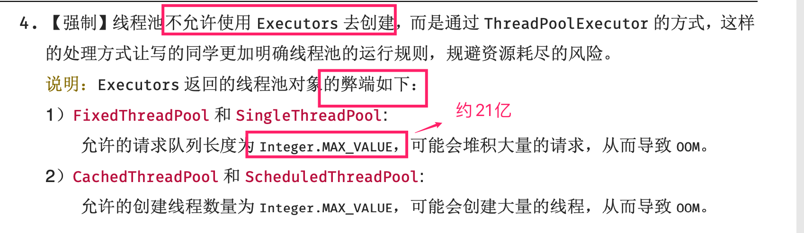

```java
package com.javaniuniu.pool;

import java.util.concurrent.ExecutorService;
import java.util.concurrent.Executors;

/**
 * Executors 工具类，3大方法
 * new Thread().start(); 传统创建线程池
 * 使用线程池后，使用线程池来创建线程
 * newSingleThreadExecutor 不推荐使用
 */
public class PoolDemo01 {
    public static void main(String[] args) {
//        ExecutorService threadPool = Executors.newSingleThreadExecutor(); // 单个线程
//        ExecutorService threadPool = Executors.newFixedThreadPool(5); // 创建一个固定个数的线程池大小
        ExecutorService threadPool =  Executors.newCachedThreadPool();// 可伸缩，遇强则强，遇弱则弱

        try {
            for (int i = 1; i <= 100; i++) {
                // 使用线程池后，使用线程池来创建线程
                threadPool.execute(() -> {
                    System.out.println(Thread.currentThread().getName() + " OK");
                });

            }
        } catch (Exception e) {
            e.printStackTrace();
        } finally {
            threadPool.shutdown();
        }
    }
}
```


> 7大参数

源码分析

```java
public static ExecutorService newSingleThreadExecutor() {
    return new FinalizableDelegatedExecutorService
        (new ThreadPoolExecutor(1, 1,
                                0L, TimeUnit.MILLISECONDS,
                                new LinkedBlockingQueue<Runnable>()));
}

public static ExecutorService newFixedThreadPool(int nThreads) {
  return new ThreadPoolExecutor(nThreads, nThreads,
                                0L, TimeUnit.MILLISECONDS,
                                new LinkedBlockingQueue<Runnable>());
}

public static ExecutorService newCachedThreadPool() {
  return new ThreadPoolExecutor(0, Integer.MAX_VALUE,// 约 21亿
                                60L, TimeUnit.SECONDS,
                                new SynchronousQueue<Runnable>());
}
// 本质 ThreadPoolExecutor()
public ThreadPoolExecutor(int corePoolSize, // 核心线程池大小
                              int maximumPoolSize, // 最大线程池大小
                              long keepAliveTime, // 超时没有人调用会释放
                              TimeUnit unit, // 超时时间
                              BlockingQueue<Runnable> workQueue, // 阻塞队列
                              ThreadFactory threadFactory, // 线程工程，创建线程的，一般不用动
                              RejectedExecutionHandler handler) // 拒绝策略 {
        if (corePoolSize < 0 ||
            maximumPoolSize <= 0 ||
            maximumPoolSize < corePoolSize ||
            keepAliveTime < 0)
            throw new IllegalArgumentException();
        if (workQueue == null || threadFactory == null || handler == null)
            throw new NullPointerException();
        this.acc = System.getSecurityManager() == null ?
                null :
                AccessController.getContext();
        this.corePoolSize = corePoolSize;
        this.maximumPoolSize = maximumPoolSize;
        this.workQueue = workQueue;
        this.keepAliveTime = unit.toNanos(keepAliveTime);
        this.threadFactory = threadFactory;
        this.handler = handler;
    }
```


> 四种拒绝策略

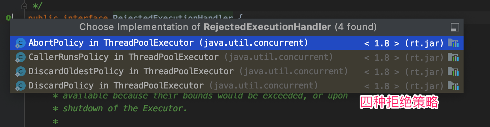


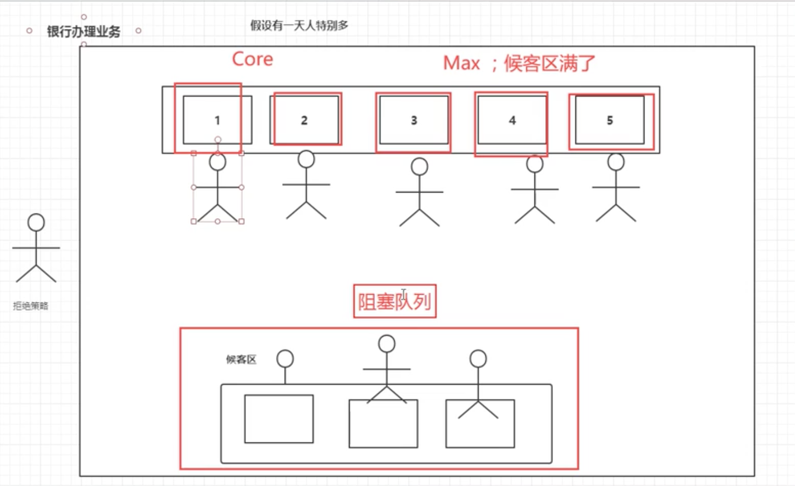

```java
package com.javaniuniu.pool;

import java.util.concurrent.*;

/**
 * Executors 工具类，4大拒绝策略
 * new ThreadPoolExecutor.AbortPolicy() // 拒绝策略，对应，银行满来，还有人进来，不处理这个人，抛出异常
 * new ThreadPoolExecutor.CallerRunsPolicy() //  哪里来的去哪里 这里多出的线程 由 main 线程执行
 * new ThreadPoolExecutor.DiscardPolicy() // 队列满了，丢掉任务，不会抛出异常
 * new ThreadPoolExecutor.DiscardOldestPolicy() // 队列满了,尝试和最早的竞争，也不会抛出异常
 */
//  以银行为例
public class PoolDemo02 {
    public static void main(String[] args) {
        // 自定义线程池，工作中 使用 ThreadPoolExecutor
        // 通过设置参数 可知，银行同一时间 最大接待人数 5 + 3
        ExecutorService threadPool = new ThreadPoolExecutor(
                2, // 银行核心柜台数
                5, // 最大柜台数
                3, // 等待超时时间 会释放线程
                TimeUnit.SECONDS, // 超时时间 秒
                new LinkedBlockingDeque<>(3), // 对应排队人数
                Executors.defaultThreadFactory(),
                new ThreadPoolExecutor.DiscardOldestPolicy() // 队列满了,尝试和最早的竞争，也不会抛出异常
                );
        try {
            // 最大承载： Deque + max
            // 超出 RejectedExecutionException
            for (int i = 1; i <=9 ; i++) {
                // 使用线程池后，使用线程池来创建线程
                threadPool.execute(()->{
                    System.out.println(Thread.currentThread().getName()+ " ok");
                });
            }
        } catch (Exception e) {
            e.printStackTrace();
        } finally {
            threadPool.shutdown();
        }
    }
}
```


> 小结和拓展

池的最大和最小如何设置？

了解 IO密集型，CPU密集型（调优）


```
// 最大线程数应该是多少？
// CPU 密集型 ，cpu几核，就是几，可以保持CPU 的效率最高
// IO 密集型  ，一般设置两倍， 判断你的程序中 十分耗 IO 的线程数
//     - 比如一个程序 15个大型业务， IO 十分占用资源
```


#### 12、四大函数式接口（必须掌握）

lambda 表达式 、链式编程、函数式接口、Stream流式计算

>函数式接口 ,只有一个方法的接口

```java
@FunctionalInterface
public interface Runnable {

    public abstract void run();
}
// 简化编程模型，在新版本的框架底层大量应用
// foreach() // 消费者类型的函数式接口
```

##### 12、1  Function 函数式接口

```java
@FunctionalInterface
public interface Function<T, R> { //范型中，传入参数T，返回参数R

    /**
     * Applies this function to the given argument.
     *
     * @param t the function argument
     * @return the function result
     */
    R apply(T t);
  ....
```

```java
package com.javaniuniu.function;

import java.util.function.Function;

/**
 * Function 函数型接口,有一个输入参数，有一个输出
 * 只要是 函数型接口 就可以用 lambda 表达式简化
 */
public class Demo01 {
    public static void main(String[] args) {
//        Function function = new Function<String,String>() {
//            @Override
//            public String apply(String str) {
//                return str;
//            }
//        };
        Function<String,String> function = (str)->{return str;};
        System.out.println(function.apply("ads"));
    }
}
```


##### 12、2  Predicate

```java
@FunctionalInterface
public interface Predicate<T> {// 范型中输入参数T，返回 布尔值

    /**
     * Evaluates this predicate on the given argument.
     *
     * @param t the input argument
     * @return {@code true} if the input argument matches the predicate,
     * otherwise {@code false}
     */
    boolean test(T t);
  ....
```

```java
package com.javaniuniu.function;

import java.util.function.Predicate;

/**
 * 断定型接口:又给输入参数，返回值只能是一个 布尔值
 */
public class PredicateDemo01 {
    public static void main(String[] args) {
        // 判断字符串是否为空
//        Predicate<String> predicate = new Predicate<String>() {
//            @Override
//            public boolean test(String str) {
//                return str.isEmpty();
//            }
//        };
        Predicate<String> predicate = (str) -> {return str.isEmpty();};
        System.out.println(predicate.test(""));
    }
}
```


##### 12、3 Consumer 消费型接口

```java
@FunctionalInterface
public interface Consumer<T> { // 消费型接口，只有输入，无返回

    /**
     * Performs this operation on the given argument.
     *
     * @param t the input argument
     */
    void accept(T t);
```

```java
package com.javaniuniu.function;

import java.util.function.Consumer;

/**
 * 消费型接口，只有输入，无返回
 */
public class ConsumerDemo {
    public static void main(String[] args) {
//        Consumer<String> consumer = new Consumer<String> () {
//            @Override
//            public void accept(String str) {
//                System.out.println(str);
//            }
//        };
        Consumer<String> consumer = (str)->{
            System.out.println(str);
        };
        consumer.accept("adf");
    }
}
```


#####  12、4 Supplier  供给型接口

```java
@FunctionalInterface
public interface Supplier<T> { // 供给型接口，没有参数，只有返回值

    /**
     * Gets a result.
     *
     * @return a result
     */
    T get();
}
```


```java
package com.javaniuniu.function;

import java.util.function.Supplier;

/**
 * 供给型接口，没有参数，只有返回值
 */
public class SupplierDemo {
    public static void main(String[] args) {
//        Supplier<String> supplier = new Supplier<String>() {
//            @Override
//            public String get() {
//                return "1234";
//            }
//        };
        Supplier<String> supplier = () -> {return "1234";};
        System.out.println(supplier.get());
    }
}
```


13、Stream 流式技术

> 什么是Stream 流式计算

集合、mysql 本质就是存储东西

计算都应该交给流来计算

```java
package com.javaniuniu.stream;

import java.util.Arrays;
import java.util.List;
import java.util.stream.Stream;

/**
 * 题目要求：一分钟内完成此题，只能用一行代码实现
 * 现在有哦5个用户 筛选
 * 1、ID 必须是偶数
 * 2、年龄必须大于 23 岁
 * 3、用户名转为大写字母
 * 4、用户名字母倒序排序
 * 5、只输出一个用户
 */
public class Test {
    public static void main(String[] args) {
        User u1 = new User(1,"a",21);
        User u2 = new User(2,"b",22);
        User u3 = new User(3,"c",23);
        User u4 = new User(4,"d",24);
        User u5 = new User(6,"e",25);

        // 集合就是存储
        List<User> list =  Arrays.asList(u1,u2,u3,u4,u5);

        // 计算交给 Stream 流
        // lambda 表达式 、链式编程、函数式接口、Stream流式计算
        list.stream()
                .filter((u)->{return u.getId()%2==0;})
                .filter((u)->{return u.getAge()>23;})
                .map(u->{return u.getName().toUpperCase();})
                .sorted((uu1,uu2)->{return uu2.compareTo(uu1);})
                .limit(1)
                .forEach(System.out::println);
    }
}
```


#### 14、ForkJoin

> 什么是 ForkJoin

ForkJoin 在jdk1.7出来，并发执行任务，提高效率，大数据量

大数据：Map Reduce （把大任务拆分为小任务）

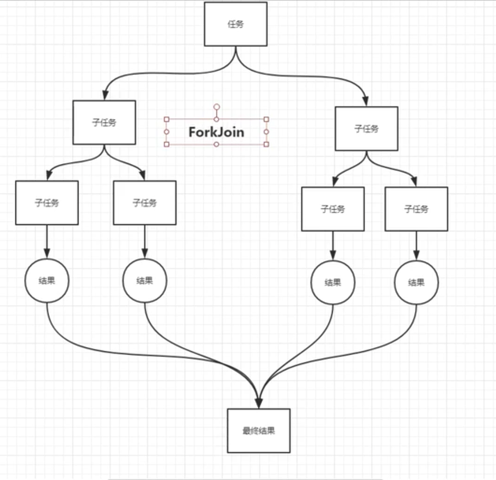

> ForkJoin 特点：工作窃取 （这个里面维护都是双端队列）
>
> 不让线程等待，可以提高效率


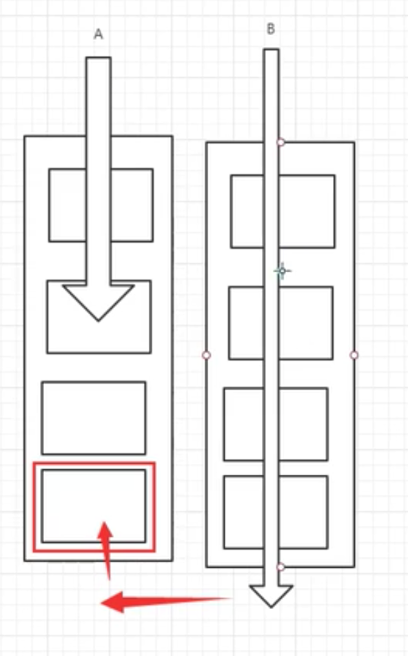


```java
package com.javaniuniu.forkjoin;

import java.util.concurrent.RecursiveTask;

/**
 * 如何使用forkjoin
 * 1、forkjonpool 通过它来执行
 * 2、计算任务 forkjoinpool.execute(ForkJoinTask task)
 * 3、计算类要继承 ForkJoinTask
 *
 */
public class ForkJoinDemo extends RecursiveTask<Long> {

    private Long start;
    private Long end;

    // 临界值
    private Long temp = 10000L;

    public ForkJoinDemo(Long start, Long end) {
        this.start = start;
        this.end = end;
    }

    public void test1() {
        if ((end-start)>temp) {
            // 分支合并计算

        }else {
            int sum = 0;
            for (int i = 0; i <10_0000_0000 ; i++) {
                sum ++;
            }
        }
    }


    // 计算方法
    @Override
    protected Long compute() {
        if ((end-start)< temp) {
            Long sum = 0L;
            for (Long i = start; i <= end ; i++) {
                sum +=i ;
            }
            return sum;

        }else { // forkjoin 递归
            // 分支合并计算
            long middle = (end + start) /2; //中间值
            ForkJoinDemo task1 = new ForkJoinDemo(start,middle);
            task1.fork(); // 拆分任务，把任务压入线程队列
            ForkJoinDemo task2 = new ForkJoinDemo(middle+1,end);
            task2.fork(); // 拆分任务，把任务压入线程队列
            return task1.join() + task2.join();

        }
    }
}
```


```java
package com.javaniuniu.forkjoin;

import java.util.concurrent.ExecutionException;
import java.util.concurrent.ForkJoinPool;
import java.util.concurrent.ForkJoinTask;
import java.util.stream.LongStream;

/**
 * 求和计算的任务
 * 解决方案
 * 1、普通for 循环 适合循环次数较少计算
 * 2、forkjon 适合循环次数较大计算
 * 3、Stream 并行流
 */
public class Test {
    public static void main(String[] args) throws ExecutionException, InterruptedException {
//        test1(); // sum= 499999999500000000 时间 8835
//        test2(); // sum= 500000000500000000 时间 5893
        test3(); // sum= 500000000500000000 时间 310
    }

    // 普通for 循环 适合循环次数较少计算
    public static void test1() {
        long start = System.currentTimeMillis();
        Long sum = 0L;
        for (Long i = 0L; i <10_0000_0000 ; i++) {
            sum += i;
        }
        long end = System.currentTimeMillis();
        System.out.println("sum= "+sum+" 时间 "+(end-start));
    }

    // forkjon 适合循环次数较大计算
    public static void test2() throws ExecutionException, InterruptedException {
        long start = System.currentTimeMillis();
        ForkJoinPool forkJoinPool = new ForkJoinPool();
        ForkJoinTask<Long> task = new ForkJoinDemo(0L,10_0000_0000L);
        ForkJoinTask<Long> submit = forkJoinPool.submit(task);// 提交任务
        Long sum = submit.get();
        long end = System.currentTimeMillis();
        System.out.println("sum= "+sum+" 时间 "+(end-start));
    }

    // Stream 并行流
    public static void test3() {
        long start = System.currentTimeMillis();

        long sum = LongStream.rangeClosed(0L, 10_0000_0000).parallel().reduce(0, Long::sum);


        long end = System.currentTimeMillis();
        System.out.println("sum= "+sum +" 时间 "+(end-start));
    }
}
```


#### 15、异步回调

>Future 设计的初衷：对将来的某个事件的结果进行建模

[CompletableFuture](https://www.matools.com/file/manual/jdk_api_1.8_google/java/util/concurrent/CompletableFuture.html)

```java
package com.javaniuniu.future;

import java.util.concurrent.CompletableFuture;
import java.util.concurrent.ExecutionException;
import java.util.concurrent.TimeUnit;

/**
 * 异步调用 可以想象 Ajax
 * 异步执行
 * 成功回调
 * 失败回调
 */
public class Demo01 {
    public static void main(String[] args) throws ExecutionException, InterruptedException {
//        test01();
        test02();
    }

    // 没有返回值的异步回调
    public static void test01() throws ExecutionException, InterruptedException {
        // 没有返回值的异步回调
        CompletableFuture<Void> completableFuture = CompletableFuture.runAsync(()->{
            try {
                TimeUnit.SECONDS.sleep(2);
            } catch (InterruptedException e) {
                e.printStackTrace();
            }
            System.out.println(Thread.currentThread().getName()+ "runAsync=>Void");
        });

        System.out.println("1111");
        completableFuture.get(); // 获取阻塞执行结果

    }

    // 有返回值的异步回调
    // 类似 ajax 成功和失败都要回调
    //
    public static void test02() throws ExecutionException, InterruptedException {
        CompletableFuture<Integer> completableFuture = CompletableFuture.supplyAsync(()->{
            try {
                TimeUnit.SECONDS.sleep(2);
            } catch (InterruptedException e) {
                e.printStackTrace();
            }
            System.out.println(Thread.currentThread().getName()+ "supplyAsync=>Void");
//            int i = 10/0;
            return 1024;

        });
        completableFuture.whenComplete((t,u)->{
            System.out.println("t:==> " +t); // 正常的返回结果
            System.out.println("u:==> " +u); // 错误信息 java.util.concurrent.ExecutionException: java.lang.ArithmeticException: / by zero
        }).exceptionally(e ->{
            System.out.println(e.getMessage());
            return 233; // 可以获取到错误的返回结果
        });


        System.out.println("1111");
        completableFuture.get(); // 获取阻塞执行结果

    }

}
```


#### 16、JMM

> 请你谈谈你对 Volatile 的理解


> 什么是 JMM （内存模型）

JMM：java内存模型，不存在的东西，一种约定，它的出现就是保证线程的安全


__关于 JMM 的一些同步约定__

1、线程解锁前，必须把贡献变量**立刻**刷回主存

2、线程加锁前，必须读取主存中的最新值到工作内存中

3、加锁和解锁是同一把锁


线程：__工作内存、主内存__

jmm中有8种操作

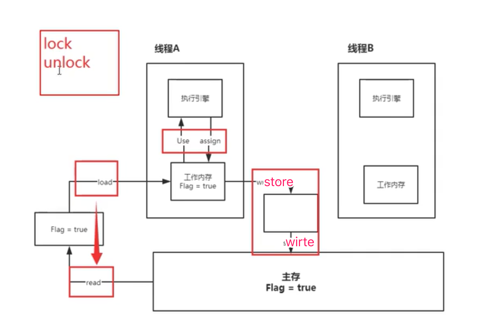

存在问题

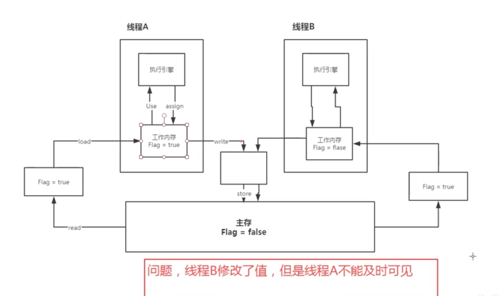

__内存交互操作有8种，虚拟机实现必须保证每一个操作都是原子的，不可在分的（对于double和long类型的变量来说，load、store、read和write操作在某些平台上允许例外）__

- lock   （锁定）：作用于主内存的变量，把一个变量标识为线程独占状态

- unlock （解锁）：作用于主内存的变量，它把一个处于锁定状态的变量释放出来，释放后的变量才可以被其他线程锁定

- read  （读取）：作用于主内存变量，它把一个变量的值从主内存传输到线程的工作内存中，以便随后的load动作使用

- load   （载入）：作用于工作内存的变量，它把read操作从主存中变量放入工作内存中

- use   （使用）：作用于工作内存中的变量，它把工作内存中的变量传输给执行引擎，每当虚拟机遇到一个需要使用到变量的值，就会使用到这个指令

- assign （赋值）：作用于工作内存中的变量，它把一个从执行引擎中接受到的值放入工作内存的变量副本中

- store  （存储）：作用于主内存中的变量，它把一个从工作内存中一个变量的值传送到主内存中，以便后续的write使用

- write 　（写入）：作用于主内存中的变量，它把store操作从工作内存中得到的变量的值放入主内存的变量中

  __JMM对这八种指令的使用，制定了如下规则：__

- 不允许read和load、store和write操作之一单独出现。即使用了read必须load，使用了store必须write

- 不允许线程丢弃他最近的assign操作，即工作变量的数据改变了之后，必须告知主存
- 不允许一个线程将没有assign的数据从工作内存同步回主内存
- 一个新的变量必须在主内存中诞生，不允许工作内存直接使用一个未被初始化的变量。就是怼变量实施use、store操作之前，必须经过assign和load操作
- 一个变量同一时间只有一个线程能对其进行lock。多次lock后，必须执行相同次数的unlock才能解锁
- 如果对一个变量进行lock操作，会清空所有工作内存中此变量的值，在执行引擎使用这个变量前，必须重新load或assign操作初始化变量的值
- 如果一个变量没有被lock，就不能对其进行unlock操作。也不能unlock一个被其他线程锁住的变量
- 对一个变量进行unlock操作之前，必须把此变量同步回主内存


问题：程序不知道主内存中的值已经被修改

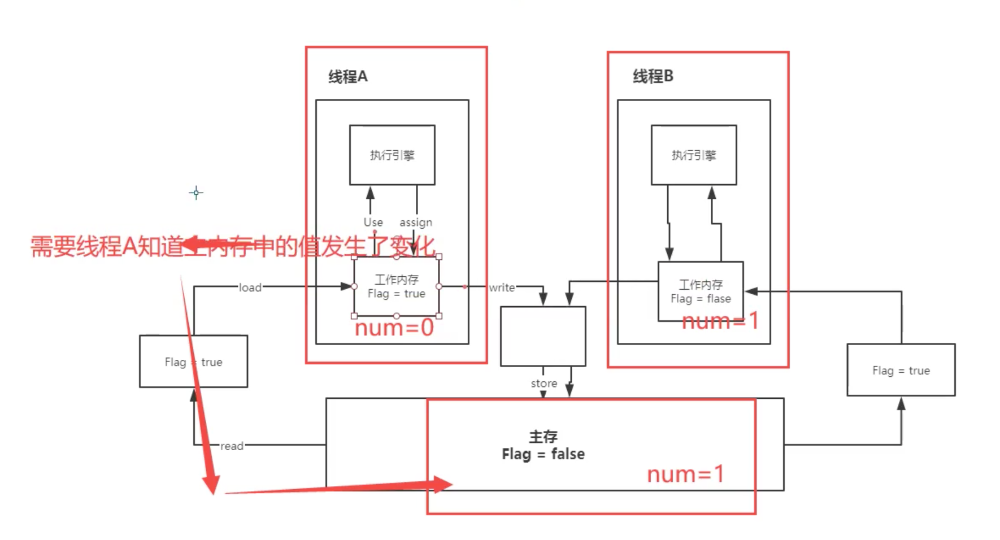


#### 17、Volatile

Volatile 是 java 轻量级的__同步机制__

1、保证可见效

2、不保证原子性

3、禁止指令重排


> 1、保证可见性

```java
package com.javaniuniu.tvolatile;

import java.util.concurrent.TimeUnit;

/**
 * JMM 可见性
 */
public class JMMDemo {
    // 不加 volatile 程序出现死循环
    // 加 volatile 可以保证可见性
    private volatile static int num = 0;
    public static void main(String[] args) {

        new Thread(()->{ // 线程1 对主线程的变化不知道
            while (num ==0) {

            }
        }).start();

        try {
            TimeUnit.SECONDS.sleep(2);
        } catch (InterruptedException e) {
            e.printStackTrace();
        }

        num =1;
        System.out.println(num);
    }
}
```

> 2、原子性 ： 不可分割

什么叫原子性？

比如：线程A在执行任务的时候，不能被打扰的，也不能被分割，要么同时成功，要么同时失败

```java
package com.javaniuniu.tvolatile;

/**
 *
 */

// volatile 不保证原子性
public class VDemo02 {

    // volatile 不保证原子性
    private volatile   static  int num = 0;

    public static void add() {
        num ++ ; // 不是原子性操作
    }

    public static void main(String[] args) {

        // 理论上 num 结果应该为 2 万
        for (int i = 1; i <=20 ; i++) {
            new Thread(()->{
                for (int j = 0; j < 1000; j++) {
                    add();
                }
            }).start();
        }

        while (Thread.activeCount() >2) { // man gc
            Thread.yield();
        }
        System.out.println(Thread.currentThread().getName() +"  " + num);
    }
}
```

如果不加 lock 和 synchronized , 怎么样保证原子性

使用原子类，解决原子问题

[ava.util.concurrent.atomic](https://www.matools.com/file/manual/jdk_api_1.8_google/java/util/concurrent/atomic/package-frame.html)

> 原子类  AtomicInteger

```java
package com.javaniuniu.tvolatile;

import java.util.concurrent.atomic.AtomicInteger;

// AtomicInteger 保证原子性，而且非常高效
public class VDemo02 {

    private static AtomicInteger num = new AtomicInteger();

    public static void add() {
        num.getAndIncrement(); // AtomicInteger +1 方法 用的是CAS，效率极高
    }

    public static void main(String[] args) {

        // 理论上 num 结果应该为 2 万
        for (int i = 1; i <=20 ; i++) {
            new Thread(()->{
                for (int j = 0; j < 1000; j++) {
                    add();
                }
            }).start();
        }

        while (Thread.activeCount() >2) { // man gc
            Thread.yield();
        }
        System.out.println(Thread.currentThread().getName() +"  " + num);
    }

```

这些类的底层都直接和操作系统挂钩，在内存中修改值，Unsafe 是一个很特殊的存在


> 指令重排

__你写的程序，计算机并不是按照你写的那样执行__

源码 -->编译器优化的重排-->指令并行也可能会重排-->内存系统也会重排-->执行

==**处理器在进行指令重排的时候，考虑：数据之间的依赖性**==

```java
int x = 1; // 1
int y = 2; // 2
x = x + 5; // 3
y = x + x; // 4
我们所期望的：1234，但是可能执行的时候会编程 2134 1324
不可能 4123！
```

可能造成影响的结果：a b x y 这个四个值默认都是0；

| 线程A | 线程B |
| ----- | ----- |
| x = a | y = b |
| b = 1 | a = 2 |

正常结果 x = 0 ,y = 0 ;但是可能由于指令重排

| 线程A | 线程B |
| ----- | ----- |
| b = 1 | a = 2 |
| x = a | y = b |

指令重排后导致诡异的结果：x =2 y =1


> volatile 可以避免指令重排

内存屏障，即CPU指令。作用：

1、保证特定的操作的执行顺序

2、保证某些变量的内存可见性（利用这些特性 保证了volatile 的可见性 ）

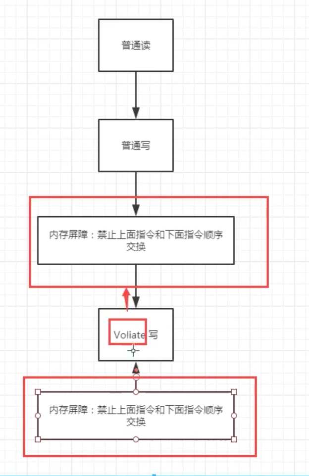


__volatile 可以保证可见性，不能保证原子性，由于内存屏障可以避免指令重排的现象产生__

==内存屏障在单例模式上使用的最多==

#### 18、彻底玩转单例模式

饿汉式，DCL懒汉式，枚举为什么可以实现单例模式


单例模式最重要的思想，__构造器私有__


> 饿汉式单例

```java
package com.javaniuniu.single;

// 饿汉式单例
// 一上来就是把所有的资源都加载进来，可能会浪费资源
public class Hungry {
    private byte[] date1 = new byte[1024*1024];
    private byte[] date2 = new byte[1024*1024];
    private byte[] date3 = new byte[1024*1024];
    private byte[] date4 = new byte[1024*1024];


    private Hungry(){}

    // 以上来 就会 new 一个对象
    private final static Hungry HUNGRY = new Hungry();

    public static Hungry getInstance() {
        return HUNGRY;
    }
}
```


> DCL 懒汉式单例1  

```java
package com.javaniuniu.single;

// 懒汉式单例
public class LazyMan {

    private LazyMan() {
        System.out.println(Thread.currentThread().getName() + " ok");
    }

    //  volatile 防止指令重排
    public volatile static LazyMan lazyMan ;

    // 给lazyMan 赋值 新生成的实体类同样需要被 static 修饰，以保证可见性
    // 双重检查锁模式 懒汉式单例 DCL懒汉式
    public static LazyMan getInstance() {
        // 加锁
        if (lazyMan == null) {
            synchronized (LazyMan.class) {
                if (lazyMan == null) {
                    lazyMan = new LazyMan();// 不是一个原子操作
                    /**
                     * 1、分配内存空间
                     * 2、执行构造方法，初始化对象
                     * 3、把这个对象指向这个空间
                     *
                     * 期望 123
                     * 可能 132 A线程
                     *          B线程 // 此时LazyMan 还没有完成构造
                     */
                }
            }
        }

        return lazyMan;
    }

    // 但线程下OK
    // 多线程下会有问题

    public static void main(String[] args) {
        for (int i = 0; i < 10; i++) {
            new Thread(() -> {
                lazyMan.getInstance();
            }).start();
//        }
        }
    }

}
```


> DCL 懒汉式单例2

```java
package com.javaniuniu.single;

import java.lang.reflect.Constructor;
import java.lang.reflect.Field;
import java.lang.reflect.InvocationTargetException;

/**
 * // 懒汉式单例
 *
 */
public class LazyManPlus {

    // 通过红绿灯的形式
    private static boolean flag = false;

    private LazyManPlus() {
        synchronized (LazyManPlus.class) {
            if (flag== false) {
                flag = true;
            }else {
                throw new RuntimeException("不要试图使用发射破坏异常");
            }
        }
    }

    //  volatile 防止指令重排
    public volatile static LazyManPlus lazyManPlus;

    // 给lazyMan 赋值 新生成的实体类同样需要被 static 修饰，以保证可见性
    // 双重检查锁模式 懒汉式单例 DCL懒汉式
    public static LazyManPlus getInstance() {
        // 加锁
        if (lazyManPlus == null) {
            synchronized (LazyManPlus.class) {
                if (lazyManPlus == null) {
                    lazyManPlus = new LazyManPlus();// 不是一个原子操作
                    /**
                     * 1、分配内存空间
                     * 2、执行构造方法，初始化对象
                     * 3、把这个对象指向这个空间
                     *
                     * 期望 123
                     * 可能 132 A线程
                     *          B线程 // 此时LazyMan 还没有完成构造
                     */
                }
            }
        }

        return lazyManPlus;
    }

    // 反射
    public static void main(String[] args) throws NoSuchMethodException, IllegalAccessException, InvocationTargetException, InstantiationException, NoSuchFieldException {
//        LazyManPlus instance1 = LazyManPlus.getInstance();
        Field flag = LazyManPlus.class.getDeclaredField("flag");
        flag.setAccessible(true);

        Constructor<LazyManPlus> constructor = LazyManPlus.class.getDeclaredConstructor(null);
        constructor.setAccessible(true); // 无视私有构造器
        LazyManPlus instance2 = constructor.newInstance(); // 1. 一个对象使用发射 一个对象通过 new
        flag.set(instance2,false); // 3. 破坏红绿灯 使得可以继续执行
        LazyManPlus instance1 = constructor.newInstance(); // 2. 两个对象都通过反射

        System.out.println(instance1);
        System.out.println(instance2);

    }
}
```


> 静态内部类

```java
package com.javaniuniu.single;

/**
 * 静态内部类
 */
public class Holder {
    private Holder() {}

    public static Holder getInstance() {
        return InnerClass.HOLDER;
    }

    public static class InnerClass {
        private static final Holder HOLDER = new Holder();
    }
}
```

__单例不安全，因为有反射__

> 枚举1

```java
package com.javaniuniu.single;


import java.lang.reflect.Constructor;
import java.lang.reflect.InvocationTargetException;

/**
 * enum 枚举
 * 本身也是一个类
 */
public enum EnumSingle {

    INSTANCE;
    public EnumSingle getInstance() {
        return INSTANCE;
    }
}
class  Test {
    public static void main(String[] args) throws NoSuchMethodException, IllegalAccessException, InvocationTargetException, InstantiationException {
        EnumSingle instance1 = EnumSingle.INSTANCE;
        Constructor<EnumSingle> declaredConstructor = EnumSingle.class.getDeclaredConstructor(String.class,int.class);
        declaredConstructor.setAccessible(true);
        EnumSingle instance2 = declaredConstructor.newInstance();
        System.out.println(instance1);
        System.out.println(instance2);
    }
}
```

> 枚举完整版

```java
package com.javaniuniu.single;

/**
 * 完整版 枚举单例模式
 */
public class User {
    //构造器私有化
    private User(){}

    static enum SingletonEnum{
        // 创建一个枚举对象，该对象天生为单例模式
        INSTANCE;
        private User user;
        // 私有化枚举的构造函数
        private SingletonEnum() {
            user = new User();
        }

        public User getInstance() {
            return user;
        }

    }
    //对外暴露一个获取User对象的静态方法
    public static User getInstance() {
        return SingletonEnum.INSTANCE.getInstance();
    }

    public static void main(String[] args) {
        System.out.println(User.getInstance());
        System.out.println(User.getInstance());
    }
}
```


#### 19、深入理解 CAS

> 什么是 CAS

__CAS：比较当前工作内存中的值和主内存中的值，如果这个值是期望的，那么则执行操作，若不是，则一直循环__

```java
package com.javaniuniu.cas;


import java.util.concurrent.atomic.AtomicInteger;

/**
 *
 */
public class CasDemo {

    // CAS compareAndSet : 比较并交换
    public static void main(String[] args) {
        AtomicInteger atomicInteger = new AtomicInteger(2020); // 设置初始值 2020 默认是 0

        // 期望 更新
        // public final boolean compareAndSet(int expect, int update)
        // 如果期望达到了，就更新，否则就不更新 ,CAS 是CPU的并发原语
        System.out.println(atomicInteger.compareAndSet(2020, 2021)); // true
        System.out.println(atomicInteger.get());
        atomicInteger.getAndIncrement(); // i++

        System.out.println(atomicInteger.compareAndSet(2020, 2021)); // false
        System.out.println(atomicInteger.get());


    }
}
```

> Unsafe类

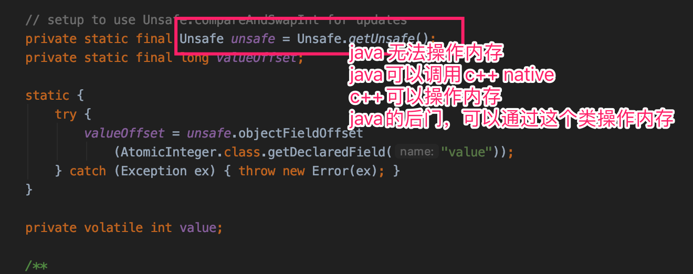

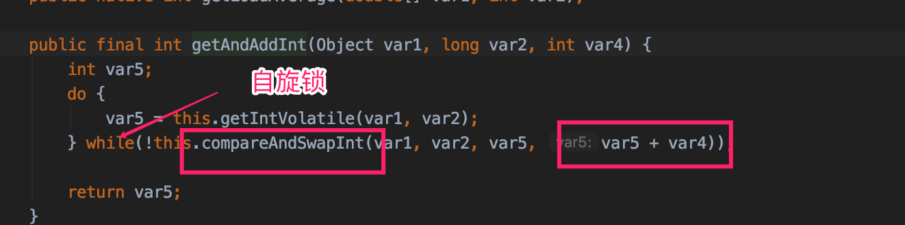


__缺点__

1、循环会耗时 （由于是自旋锁）

2、一次性只能保证一个共享变量的原子性（由于底层是CPU操作）

3、ABA问题


> CAS ABA 问题

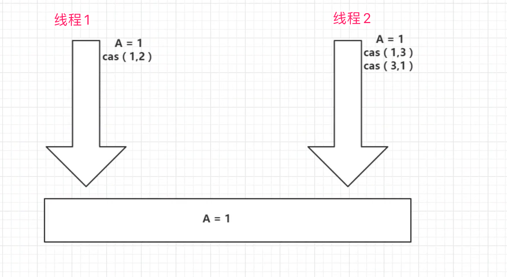

```java
package com.javaniuniu.cas;

import java.util.concurrent.atomic.AtomicInteger;

public class CasDemo {

    // CAS compareAndSet : 比较并交换
    public static void main(String[] args) {
        AtomicInteger atomicInteger = new AtomicInteger(2020); // 设置初始值 2020 默认是 0

        // 对于我们平时写的SQL ： 乐观锁

        // 期望 更新
        // public final boolean compareAndSet(int expect, int update)
        // 如果期望达到了，就更新，否则就不更新 ,CAS 是CPU的并发原语
        // ===============================捣乱的线程============================
        System.out.println(atomicInteger.compareAndSet(2020, 2021)); // true
        System.out.println(atomicInteger.get());
        System.out.println(atomicInteger.compareAndSet(2021, 2020)); // true
        System.out.println(atomicInteger.get());

        // ===============================期望的线程============================
        System.out.println(atomicInteger.compareAndSet(2020, 6666)); // true
        System.out.println(atomicInteger.get());


    }
}
```


#### 20、原子引用

> ABA 问题 ，引入原子引用，对应的思想是乐观锁

带版本号的

__Integer 使用了对象缓存机制，默认范围是 -128--127，推荐使用静态工程方法 valueOf 获取对象实例，而不是 new ，因为 valueOf 使用缓存，而 new 一定会创建新的对象分配新的内存空间__

___对于 Integer var = ? 在-128 至 127 范围内的赋值，==Integer 对象是在 IntegerCache.cache 产生，会复用已有对象==，这个区间内的 Integer 值可以直接使用\==进行 判断，==但是这个区间之外的所有数据，都会在堆上产生，并不会复用已有对象==，这是一个  ==大坑==， 推荐使用 equals 方法进行判断。___

```java
package com.javaniuniu.cas;

import java.util.concurrent.TimeUnit;
import java.util.concurrent.atomic.AtomicStampedReference;

public class CasDemo2 {

    // CAS compareAndSet : 比较并交换
    public static void main(String[] args) {

        // AtomicStampedReference 注意：如果范型是一个包装类，注意对象的引用问题
        AtomicStampedReference<Integer> atomicStampedReference = new AtomicStampedReference(1,1);

        new Thread(()->{
            int stamp = atomicStampedReference.getStamp(); // 获取版本号
            System.out.println("a1=>"+stamp);
            try {
                TimeUnit.SECONDS.sleep(2);
            } catch (InterruptedException e) {
                e.printStackTrace();
            }
            System.out.println(atomicStampedReference.compareAndSet(1, 2,
                    atomicStampedReference.getStamp(), atomicStampedReference.getStamp() + 1));
            System.out.println("a2=>"+atomicStampedReference.getStamp());

            System.out.println(atomicStampedReference.compareAndSet(2, 1,
                    atomicStampedReference.getStamp(), atomicStampedReference.getStamp() + 1));
            System.out.println("a3=>"+atomicStampedReference.getStamp());


        },"a").start();

        // 和乐观锁的原理相同
        new Thread(()->{
            int stamp = atomicStampedReference.getStamp(); // 获取版本号
            System.out.println("b1=>"+stamp);
            try {
                TimeUnit.SECONDS.sleep(2);
            } catch (InterruptedException e) {
                e.printStackTrace();
            }
            System.out.println(atomicStampedReference.compareAndSet(1, 6,
                    atomicStampedReference.getStamp(), atomicStampedReference.getStamp() + 1));
            System.out.println("b2=>"+atomicStampedReference.getStamp());

        },"b").start();

    }
}
```


#### 21、各种锁的理解

##### 1、公平锁、非公平锁

公平锁：  先来后到，不能插队

非公平锁：可以插队（默认是非公平锁）

```java
public ReentrantLock() {
    sync = new NonfairSync();
}
public ReentrantLock(boolean fair) { //在这个设置公平锁和非公平锁
  	sync = fair ? new FairSync() : new NonfairSync();
}
```

##### 2、可重入锁

可重入锁也叫递归锁，且所有的锁都是可重入锁，

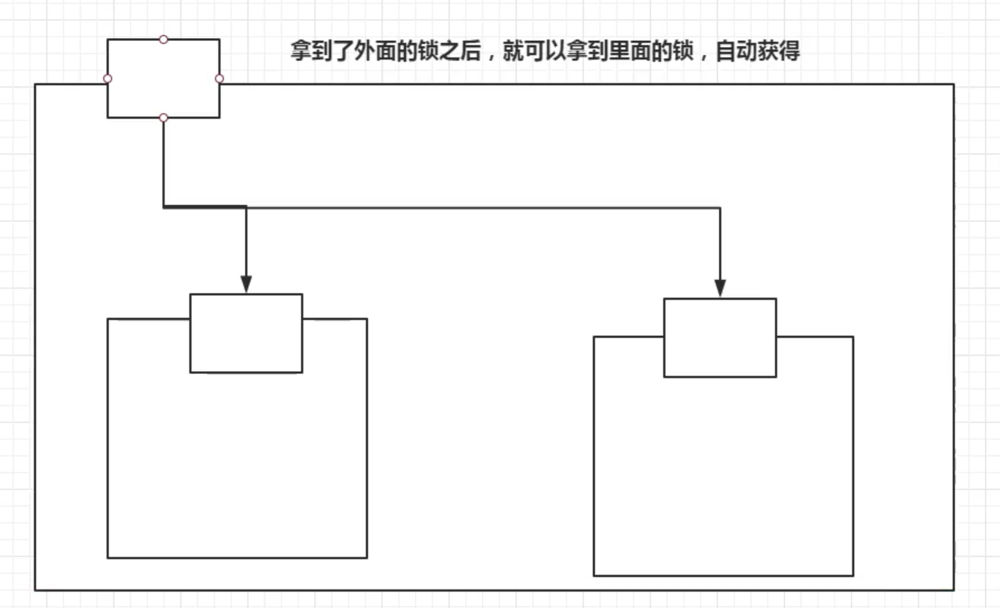

> synchronized 版

```java
package com.javaniuniu.lock;

// 可重入锁
public class Demo01 {

    public static void main(String[] args) {
        Phone phone = new Phone();
        new Thread(()->{
            phone.sms();
        },"A").start();

        new Thread(()->{
            phone.sms();
        },"B").start();
    }
}

class Phone {
    public synchronized void sms() {
        System.out.println(Thread.currentThread().getName()+" sms");
        call();
    }

    public synchronized void call() {
        System.out.println(Thread.currentThread().getName()+" call");
    }
}
```

> Lock 版

```java
package com.javaniuniu.lock;

import java.util.concurrent.locks.Lock;
import java.util.concurrent.locks.ReentrantLock;

/**
 * @auther: javaniuniu
 * @date: 2020/6/29 12:33 AM
 */
public class Demo02 {

    public static void main(String[] args) {
        Phone2 phone = new Phone2();
        new Thread(()->{
            phone.sms();
        },"A").start();

        new Thread(()->{
            phone.sms();
        },"B").start();
    }
}

class Phone2 {
    Lock lock = new ReentrantLock();
    public void sms() {
        lock.lock(); // 细节问题 lock.lock() ，lock.unlock();
        // lock 必须配对，否则就会死在里面
        try {
            System.out.println(Thread.currentThread().getName()+" sms");
            call();
        } catch (Exception e) {
            e.printStackTrace();
        } finally {
            lock.unlock();
        }

    }

    public synchronized void call() {
        lock.lock();
        try {
            System.out.println(Thread.currentThread().getName()+" call");
        } catch (Exception e) {
            e.printStackTrace();
        } finally {
            lock.unlock();
        }
    }
}
```


##### 3、自旋锁

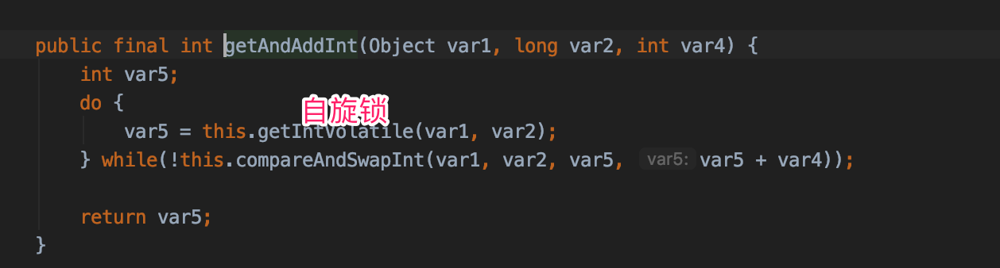

```jsva
package com.javaniuniu.lock;

import java.util.concurrent.TimeUnit;
import java.util.concurrent.atomic.AtomicReference;

/**
 * 自旋锁
 * 加锁解锁的时候 不断的判断 是否加锁 或者解了锁
 */
public class SpinLockDemo {

    // int 0
    // Thread null
    AtomicReference<Thread> atomicReference = new AtomicReference<>();
    // 加锁
    public void myLock() {
        Thread thread = Thread.currentThread();
        System.out.println(Thread.currentThread().getName()+ " ==>mylock");

        // 自旋锁
        while (!atomicReference.compareAndSet(null,thread)) {
            System.out.println(Thread.currentThread().getName()); //T2 一直在自旋
        }
    }

    // 解锁
    public void myUnLock() {
        Thread thread = Thread.currentThread();
        System.out.println(Thread.currentThread().getName()+ " ==>myUnlock");

        atomicReference.compareAndSet(thread,null);
    }

}

class TestSpinLock {
    public static void main(String[] args) {
        SpinLockDemo lock = new SpinLockDemo();
        new Thread(()->{
            lock.myLock();
            try {
                TimeUnit.SECONDS.sleep(1);
            } catch (InterruptedException e) {
                e.printStackTrace();
            }finally {
                lock.myUnLock();
            }
        },"T1").start();

        new Thread(()->{
            lock.myLock();
            try {
                TimeUnit.SECONDS.sleep(1);
            } catch (InterruptedException e) {
                e.printStackTrace();
            }finally {
                lock.myUnLock();
            }
        },"T2").start();


    }
}
```


##### 4、死锁

死锁是什么

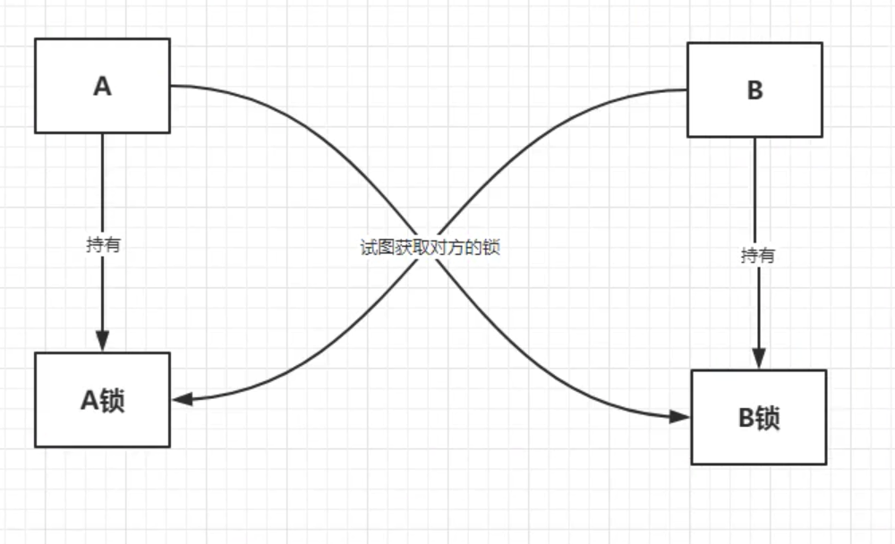

死锁怎么判断

```java
package com.javaniuniu.lock;

import java.util.concurrent.TimeUnit;

/**
 * 死锁
 */
public class DeadLockDemo {
    public static void main(String[] args) {
        String lockA = "lockA";
        String lockB = "lockB";

        new Thread(new MyThread(lockA,lockB),"T1").start();
        new Thread(new MyThread(lockB,lockA),"T2").start();
    }
}
class MyThread implements Runnable{

    private String lockA;
    private String lockB;

    public MyThread(String lockA, String lockB) {
        this.lockA = lockA;
        this.lockB = lockB;
    }

    @Override
    public void run() {
        synchronized (lockA) {
            System.out.println(Thread.currentThread().getName()+
                    "lock:"+lockA+"==>get"+lockB);
            try {
                TimeUnit.SECONDS.sleep(2);
            } catch (InterruptedException e) {
                e.printStackTrace();
            }
            synchronized (lockB) {
                System.out.println(Thread.currentThread().getName()+
                        "lock:"+lockB+"==>get"+lockA);
            }
        }

    }
}
```

解决问题

1、使用 `jps -l` 定位进程号

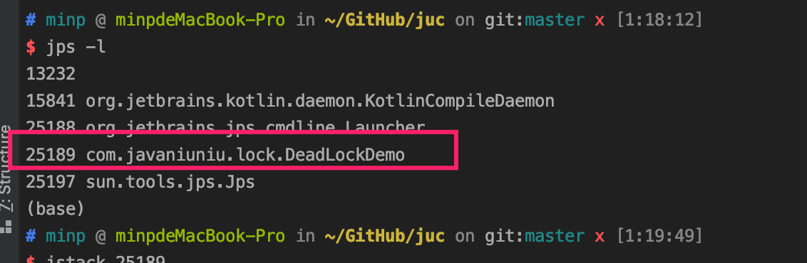

2、使用 `jstack 进程号` 找到死锁问题

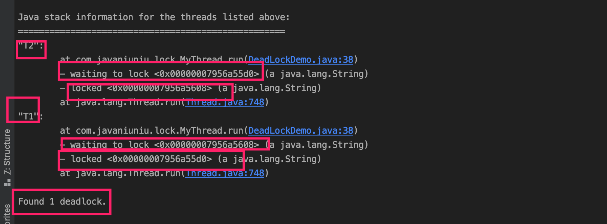

排查问题：

1、查看日志

2、看堆


##### 5、悲观锁(Pessimistic Lock)

顾名思义，就是很悲观，每次去拿数据的时候都认为别人会修改，所以__每次在拿数据的时候都会上锁__，这样别人想拿这个数据就会block直到它拿到锁。传统的关系型数据库里边就用到了很多这种锁机制，比如行锁，表锁等，读锁，写锁等，都是在做操作之前先上锁。它指的是对数据被外界（包括本系统当前的其他事务，以及来自外部系统的事务处理）修改持保守态度，因此，在整个数据处理过程中，将数据处于锁定状态。__悲观锁的实现，往往依靠数据库提供的锁机制__（也只有数据库层提供的锁机制才能真正保证数据访问的排他性，否则，即使在本系统中实现了加锁机制，也无法保证外部系统不会修改数据）。


##### 6、乐观锁(Optimistic Lock)

顾名思义，就是很乐观，每次去拿数据的时候都认为别人不会修改，所以不会上锁，但是在更新的时候会判断一下在此期间别人有没有去更新这个数据，可以__使用版本号等机制__。__乐观锁适用于多读的应用类型__，这样可以提高吞吐量，像数据库如果提供类似于write_condition机制的其实都是提供的乐观锁。


__两种锁各有优缺点__，不可认为一种好于另一种，像乐观锁适用于写比较少的情况下，即冲突真的很少发生的时候，这样可以省去了锁的开销，加大了系统的整个吞吐量。但如果经常产生冲突，上层应用会不断的进行retry，这样反倒是降低了性能，所以这种情况下用悲观锁就比较合适。本质上，数据库的乐观锁做法和悲观锁做法主要就是解决下面假设的场景，避免丢失更新问题：


22、多线程图谱


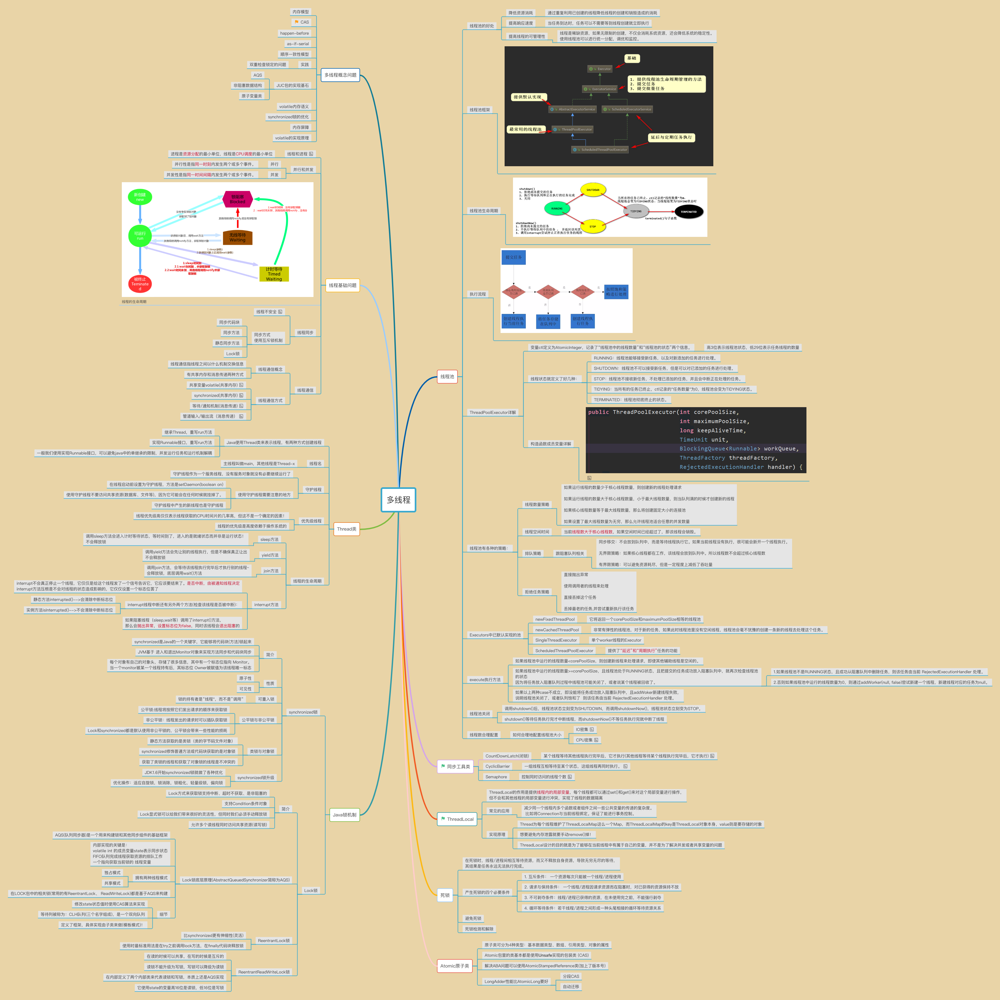